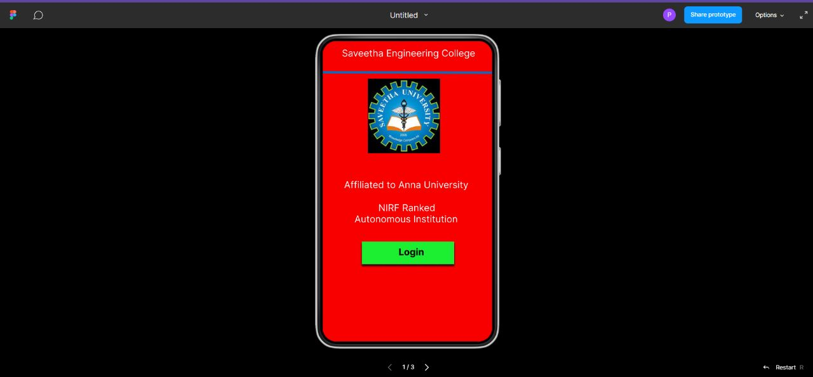
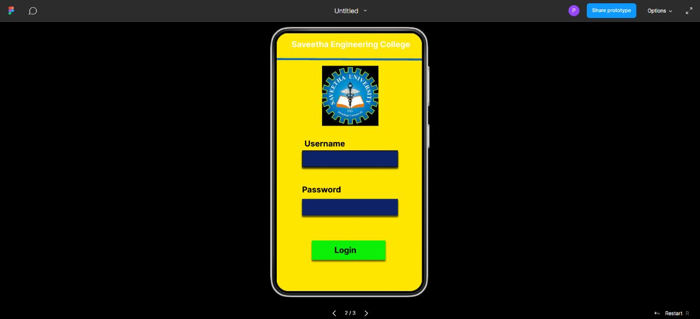

# Event Registration Web Application

## AIM:
To design, develop and deploy a web application for event registration.

## DESIGN STEPS:

### Step 1:
Create number of pages as needed

## Step 2:
Design the web pages

## Step 3:
Create HTML and CSS codes for the web pages

## Step 4:
Add the needed images for web pages

## Step 5:
Add styles for webpages

### Step 6:
Validate the HTML and CSS code.

### Step 6:
Publish the website in the given URL.

## PROGRAM :
```
/* Home page */
position: relative;
width: 360px;
height: 640px;
background: #F70000;

/* Login page */
position: relative;
width: 360px;
height: 640px;
background: #FFE600;

/* SEC page */
position: relative;
width: 360px;
height: 640px;
background: #8A1E72;

/* Saveetha Engineering College */

position: absolute;
width: 314px;
height: 33px;
left: 24px;
top: 14px;
font-family: 'Inter';
font-style: normal;
font-weight: 400;
font-size: 20px;
line-height: 24px;
color: #FFFFFF;

/* Line 1 */

position: absolute;
width: 360px;
height: 0px;
left: 0px;
top: 69px;
border: 5px solid #1469B7;
transform: rotate(0.16deg);

/* logo 1 */

position: absolute;
width: 153px;
height: 159px;
left: 96px;
top: 80px;
background: url(logo.jpg);

/* Affiliated to Anna University */

position: absolute;
width: 314px;
height: 34px;
left: 23px;
top: 294px;
font-family: 'Inter';
font-style: normal;
font-weight: 400;
font-size: 20px;
line-height: 24px;
color: #FFFFFF;

/* NIRF Ranked Autonomous Institution */

position: absolute;
width: 337px;
height: 53px;
left: 0px;
top: 343px;
font-family: 'Inter';
font-style: normal;
font-weight: 400;
font-size: 20px;
line-height: 24px;
color: #FFFFFF;

/* Rectangle 1 */

position: absolute;
width: 196px;
height: 48px;
left: 83px;
top: 427px;
background: #1CEF31;
box-shadow: 0px 4px 4px rgba(0, 0, 0, 0.25), 0px 4px 4px rgba(0, 0, 0, 0.25), 0px 4px 4px rgba(0, 0, 0, 0.25), 0px 4px 4px rgba(0, 0, 0, 0.25), 0px 4px 4px rgba(0, 0, 0, 0.25);

/* Login */

position: absolute;
width: 78px;
height: 32px;
left: 161px;
top: 437px;
font-family: 'Inter';
font-style: normal;
font-weight: 700;
font-size: 20px;
line-height: 24px;
color: #150606;

/* Saveetha Engineering College */

position: absolute;
width: 314px;
height: 38px;
left: 23px;
top: 16px;
font-family: 'Inter';
font-style: normal;
font-weight: 700;
font-size: 20px;
line-height: 24px;
color: #FFFFFF;

/* Line 1 */

position: absolute;
width: 360px;
height: 0px;
left: 0px;
top: 67px;
border: 5px solid #1469B7;
transform: rotate(0.16deg);

/* logo 1 */

position: absolute;
width: 140px;
height: 149px;
left: 112px;
top: 81px;
background: url(logo.jpg);

/* Rectangle 2 */

box-sizing: border-box;
position: absolute;
width: 237px;
height: 41px;
left: 63px;
top: 291px;
background: #0E2268;
box-shadow: 0px 4px 4px rgba(0, 0, 0, 0.25), 0px 4px 4px rgba(0, 0, 0, 0.25), 0px 4px 4px rgba(0, 0, 0, 0.25), 0px 4px 4px rgba(0, 0, 0, 0.25), 0px 4px 4px rgba(0, 0, 0, 0.25);

/* Username */

position: absolute;
width: 148px;
height: 29px;
left: 69px;
top: 262px;
font-family: 'Inter';
font-style: normal;
font-weight: 700;
font-size: 20px;
line-height: 24px;
color: #000000;

/* Rectangle 3 */

position: absolute;
width: 237px;
height: 41px;
left: 63px;
top: 411px;
background: #0E2268;
box-shadow: 0px 4px 4px rgba(0, 0, 0, 0.25), 0px 4px 4px rgba(0, 0, 0, 0.25), 0px 4px 4px rgba(0, 0, 0, 0.25), 0px 4px 4px rgba(0, 0, 0, 0.25);

/* Password */

position: absolute;
width: 206px;
height: 29px;
left: 63px;
top: 376px;
font-family: 'Inter';
font-style: normal;
font-weight: 700;
font-size: 20px;
line-height: 24px;
color: #000000;

/* Rectangle 4 */

position: absolute;
width: 182px;
height: 48px;
left: 87px;
top: 514px;
background: #0CF007;
box-shadow: 0px 4px 4px rgba(0, 0, 0, 0.25), 0px 4px 4px rgba(0, 0, 0, 0.25), 0px 4px 4px rgba(0, 0, 0, 0.25);

/* Login */

position: absolute;
width: 55px;
height: 24px;
left: 143px;
top: 526px;
font-family: 'Inter';
font-style: normal;
font-weight: 700;
font-size: 20px;
line-height: 24px;
color: #000000;

/* Saveetha Engineering College */

position: absolute;
width: 314px;
height: 38px;
left: 23px;
top: 21px;
font-family: 'Inter';
font-style: normal;
font-weight: 700;
font-size: 20px;
line-height: 24px;
color: #FFFFFF;

/* Line 1 */

position: absolute;
width: 360px;
height: 0px;
left: 0px;
top: 77px;
border: 5px solid #1469B7;
transform: rotate(0.16deg);

/* logo 1 */

position: absolute;
width: 135px;
height: 141px;
left: 110px;
top: 88px;
background: url(logo.jpg);

/* Departments */

position: absolute;
width: 277px;
height: 50px;
left: 49px;
top: 270px;
font-family: 'Inter';
font-style: normal;
font-weight: 700;
font-size: 20px;
line-height: 24px;
text-align: center;
color: #000000;

/* AIML */

position: absolute;
width: 192px;
height: 48px;
left: 91px;
top: 334px;
font-family: 'Inter';
font-style: normal;
font-weight: 700;
font-size: 20px;
line-height: 24px;
text-align: center;
color: #FFFFFF;

/* AIDS */

position: absolute;
width: 197px;
height: 58px;
left: 86px;
top: 396px;
font-family: 'Inter';
font-style: normal;
font-weight: 700;
font-size: 20px;
line-height: 24px;
text-align: center;
color: #FFFFFF;

/* IOT */

position: absolute;
width: 237px;
height: 76px;
left: 66px;
top: 454px;
font-family: 'Inter';
font-style: normal;
font-weight: 700;
font-size: 20px;
line-height: 24px;
text-align: center;
color: #FFFFFF;

/* CS */

position: absolute;
width: 191px;
height: 27px;
left: 89px;
top: 516px;
font-family: 'Inter';
font-style: normal;
font-weight: 700;
font-size: 20px;
line-height: 24px;
text-align: center;
color: #FFFFFF;
``` 
## Design:

## OUTPUT:




## Result:
Hence the UX design for the Event Registration webpage is done
